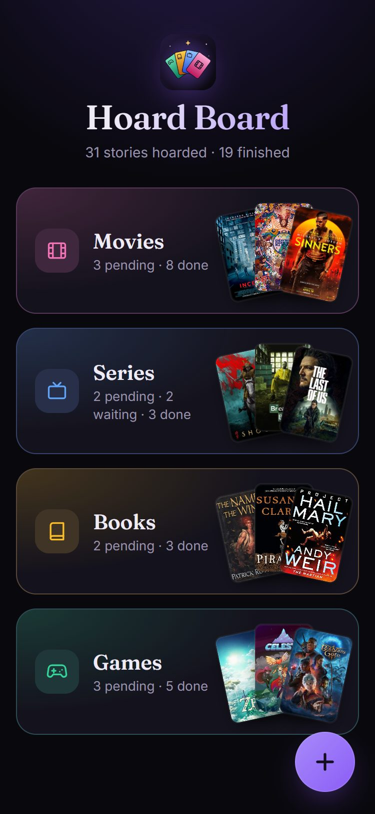
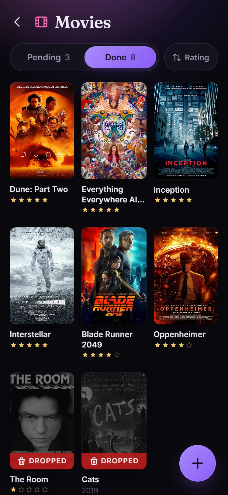
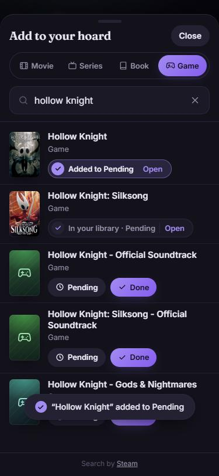
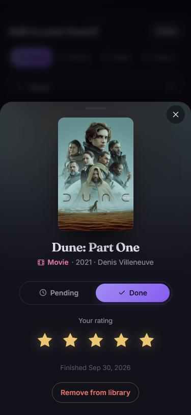
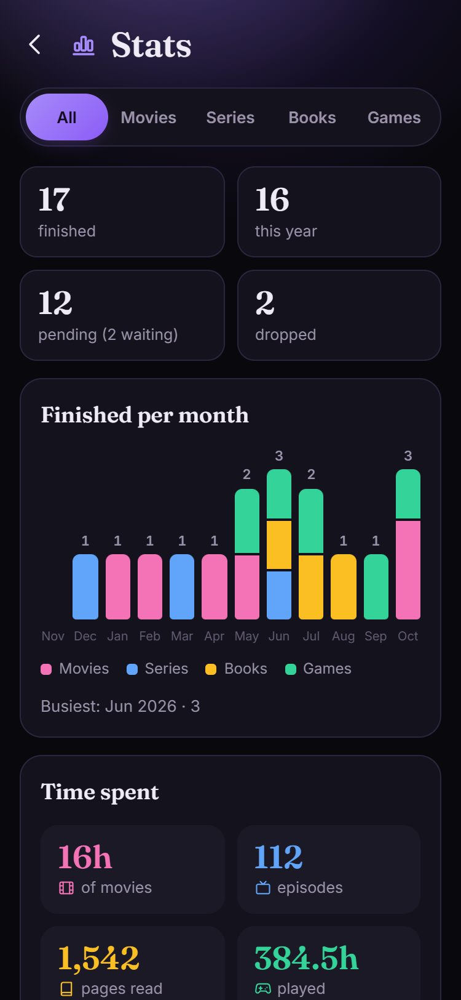

# Hoard Board

A personal library of movies, series, books and games, as a Home Assistant add-on.

Search for something, add it as **Pending** or **Done**, and give
finished things an optional 5-star rating. Every item shows its cover. Made for phones, in portrait.

<p>
  
  
  
  
  
</p>

## Installation

Add this repository to Home Assistant:

1. Go to **Settings** → **Add-ons** → **Add-on Store**
2. Click menu (⋮) → **Repositories**
3. Add: `https://github.com/christina-thd/virtual-library`
4. Install **Hoard Board** from the store

## Add-ons

### Hoard Board

Keep track of what you've watched, read and played, and what's still pending.

**Features:**
- Movies, series, books and games in one place, each with its cover
- Search built in, no account or API key needed
- A home screen per kind, Pending and Done lists (series also Waiting, for a new season), and an optional 5-star rating
- Stats: what you finished each month, your top genres, time spent and more

[Documentation →](./virtual-library/README.md)

## Development

The app is plain Node.js with no build step and no dependencies. See
[virtual-library/docs/DEVELOPMENT.md](./virtual-library/docs/DEVELOPMENT.md).

```sh
cd virtual-library
npm test
npm run dev
```

## Support

For issues, check the add-on logs or open an issue in this repository.

Search results and covers come from [Cinemeta](https://www.stremio.com/), [TVmaze](https://www.tvmaze.com/),
[Open Library](https://openlibrary.org/), [Apple Books](https://www.apple.com/apple-books/), [Steam](https://store.steampowered.com/),
[GOG](https://www.gog.com/) and [Nintendo](https://www.nintendo.com/) (plus [TMDB](https://www.themoviedb.org/)
and [RAWG](https://rawg.io/) with your own API keys). This project is not affiliated with or endorsed by any of them.
